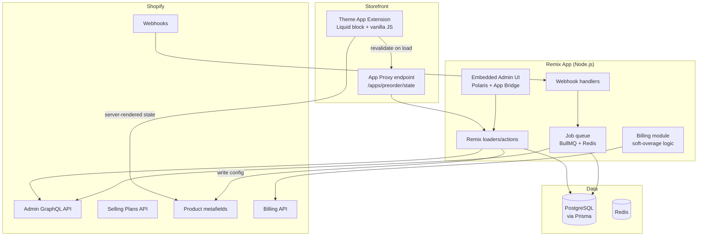

# Pre-order App — MVP Architecture (P0)

Stack: **Shopify Remix template** (Remix + Node.js + Prisma + PostgreSQL) · Theme App Extensions · Shopify Billing API

Design driven by review-mining findings: billing trust is the #1 complaint, button/display bugs #2, silent failures #3. Every architectural choice below traces back to one of those.

---

## 1. System Overview



---

## 2. Core Design Decisions (research → architecture)

| Research finding | Architectural decision |
|---|---|
| Theme breakage, uninstall residue (STOQ, Amai) | **Theme App Extension only.** Zero theme code injection, zero ScriptTags. Shopify auto-removes the block on uninstall — clean uninstall is structural, not promised. |
| Cached add-to-cart button shown instead of pre-order (Amai, 6 yrs unfixed) | **Two-layer rendering:** (1) Liquid renders correct button server-side from product metafields — works even with JS disabled; (2) tiny JS revalidates live state via App Proxy on page load, fixing CDN/browser-cached pages. |
| Broken on iPhone (Amai) | Widget is plain Liquid + ~3KB vanilla JS, no framework, no DOM-hacking of theme buttons. The block renders **its own** button and hides the native one via the block's own scoped CSS. Mobile-first QA in CI (Playwright against dev store, iPhone viewport). |
| Plan-limit cutoffs mid-sale costing thousands (STOQ, Timesact) | **Never-block billing engine:** usage caps trigger emails at 70/90/100% but the widget never turns off. Overage billed next cycle via Billing API usage records with merchant-approved capped amount. |
| Surprise charges, post-cancel billing (Notify!, Amai) | All billing through **Shopify Billing API only** (no external billing). Cancel = Shopify kills the subscription instantly. Plan changes require explicit merchant approval screen. |
| "Worked until it didn't" silent failures | Webhook-driven state + **daily reconciliation job** that re-syncs metafields against DB config and flags drift. |

---

## 3. Components

### 3.1 Theme App Extension (storefront widget)
- **Block:** `preorder-button.liquid` — app block targeting the product page buy-buttons area.
- Reads config from product/variant **metafields** (namespace `$app:preorder`): `enabled`, `message`, `ship_date`, `badge_text`.
- Renders pre-order button + "Ships by {date}" message server-side.
- `preorder.js` (deferred, ~3KB): on load, fetches `/apps/preorder/state?variant_id=X` through App Proxy → corrects state if page was cached stale. Also handles variant-switch events.
- **No access to theme code. Never edits the merchant's theme.**

### 3.2 App Proxy endpoint
- `GET /apps/preorder/state` → Remix loader, HMAC-verified, returns `{enabled, message, ship_date}` per variant from Postgres (Redis-cached 30s).
- Same endpoint doubles as the widget **heartbeat**: logs last-seen per shop, powering the silent-failure alert (P1-ready).

### 3.3 Embedded Admin (Remix + Polaris)
Pages: **Dashboard** (active pre-orders, usage meter), **Products** (enable/disable per product/variant, message + ship date), **Settings** (button text/colors — addresses STOQ's "limited customization" complaint), **Pricing** (plan picker, plain-language: what happens at the limit → "your sales never stop").

### 3.4 Pre-order mechanics (Selling Plans)
- MVP = **pay-now pre-orders** via the native **Selling Plans API** (`purchase option: pre-order, full payment at checkout`). Native = orders, payments, refunds all live in Shopify; no third-party money-limbo (the STOQ $2k trap is structurally avoided by deferring deposits/partial payments to P1).
- Enabling a product: mutation creates/attaches selling plan group + writes metafields + tags product `preorder`.
- Orders tagged `preorder` via `orders/create` webhook for filtering/fulfillment holds (`FulfillmentHold` on the pre-order items).

### 3.5 Webhooks (processed via queue, idempotent)
| Topic | Action |
|---|---|
| `orders/create` | Tag order, apply fulfillment hold, increment usage counter |
| `inventory_levels/update` | Optional rule: auto-enable pre-order at stock 0 (config flag) |
| `products/update`, `products/delete` | Keep config/metafields in sync |
| `app_subscriptions/update` | Sync plan state |
| `app/uninstalled` | Mark shop inactive, schedule data purge (30 days), stop all billing |
| GDPR topics (`customers/data_request` etc.) | Mandatory compliance handlers |

### 3.6 Billing module (the trust wedge)
- Plans: Free (10 pre-orders/mo) · Growth $15/mo (300) · Pro $29/mo (unlimited).
- Recurring charge + usage line with merchant-set cap. At limit: **email + in-app banner, widget stays live.** Overage ($0.05/order) billed next cycle, hard-capped at the next tier's price (so overage can never exceed simply upgrading — this is the marketing line).
- Every plan event (upgrade, limit-warning, overage) → email via Resend/Postmark. Nothing silent, ever.

---

## 4. Data Model (Prisma)

```prisma
model Shop {
  id            String   @id            // shop domain
  accessToken   String                  // managed by shopify-app-remix session storage
  plan          Plan     @default(FREE)
  usageThisCycle Int     @default(0)
  cycleStart    DateTime
  uninstalledAt DateTime?
  settings      Json                    // button text, colors, defaults
  products      PreorderConfig[]
  events        BillingEvent[]
}

model PreorderConfig {
  id           String  @id @default(cuid())
  shopId       String
  productId    String                   // Shopify GID
  variantId    String?                  // null = all variants
  enabled      Boolean @default(true)
  message      String?
  shipDate     DateTime?
  sellingPlanGid String?
  autoEnableAtZero Boolean @default(false)
  shop         Shop    @relation(fields: [shopId], references: [id])
  @@unique([shopId, productId, variantId])
}

model PreorderOrder {
  id        String   @id @default(cuid())
  shopId    String
  orderGid  String   @unique
  lineItems Json
  createdAt DateTime @default(now())
}

model BillingEvent {                    // audit trail = billing-dispute armor
  id        String   @id @default(cuid())
  shopId    String
  type      String                      // limit_70, limit_100, overage_billed, plan_change...
  payload   Json
  emailedAt DateTime?
  createdAt DateTime @default(now())
  shop      Shop     @relation(fields: [shopId], references: [id])
}
```

---

## 5. Key Flows

**Enable pre-order:** Admin UI → Remix action → (1) create selling plan group via GraphQL, (2) write metafields, (3) upsert `PreorderConfig`, (4) tag product. All four in a saga; failure rolls back metafields so storefront never shows half-state.

**Customer purchase:** Product page → Liquid renders pre-order button from metafields → JS revalidates via proxy → add to cart with selling plan → native checkout → `orders/create` webhook → tag + fulfillment hold + usage++.

**Hit plan limit:** usage == 70% → email. == 100% → email + banner: "Pre-orders continue. Overage $0.05/order, capped at $X." Widget untouched. `BillingEvent` row logged for every notice (dispute-proof audit trail).

**Uninstall:** Shopify removes theme block automatically → `app/uninstalled` → cancel subscription state, schedule purge. Metafields become orphaned-but-inert (Liquid block gone, nothing renders). No leftover behavior — the May Coffee Crew failure mode is impossible.

---

## 6. Infra & Ops

- **Hosting:** Fly.io or Railway (Remix app + worker process), managed Postgres, Upstash Redis. ~$25–40/mo at launch.
- **CI:** GitHub Actions — typecheck, unit tests, Playwright storefront test on a dev store (desktop + iPhone viewport) on every deploy. *The Amai cache bug and mobile bug both ship-blocked here.*
- **Monitoring:** Sentry (errors), heartbeat table from App Proxy (widget liveness), daily reconciliation job (metafield ↔ DB drift).
- **Built for Shopify targets:** embedded, App Bridge latest, Polaris, Core Web Vitals budget on the widget (<10KB total storefront payload).

---

## 7. Compliance Flows (Shopify requirement 5.4.17 and 5.4.8)

### 7.1 Ship-date change notification (5.4.17)

When a merchant edits a pre-order and moves the ship date **later**:

1. Admin UI (`app/routes/app.products.tsx`) sends `intent=update` to the Remix action.
2. Action detects `newDate > oldDate` and, if not yet confirmed, returns `{ needsConfirm: true, affectedCount }` without saving.
3. Frontend shows a modal: "Save & notify N customers". Merchant clicks → resubmits with `confirmed=true`.
4. Action calls `updatePreorder()` (preorder-saga.server.ts) which updates metafields and DB, then enqueues a `NotifyJobData` job on the `notifications` BullMQ queue.
5. `handleShipDateNotify` job handler (app/jobs/handlers/ship-date-notify.server.ts):
   - Pages through `PreorderOrder` for the shop, filtering by product/variant ID.
   - For each matching order, calls `unauthenticated.admin(shop).graphql` to check `displayFulfillmentStatus`.
   - Skips `FULFILLED` / `RESTOCKED` orders.
   - Sends ship-date-delay email via Resend with `storeName` as sender, old/new dates, order status link.
   - Writes `CustomerNotification` row (`type: "ship_date_delay"`, `dedupeKey: "${configId}:${newDate}:${orderGid}"`). Idempotent — skips if row already exists.
6. Admin UI shows a success banner after the job is queued.

**Settings page** (`app/routes/app.settings.tsx`): merchant can add custom `notificationIntroText` appended to the top of every notification email.

### 7.2 Buyer self-cancellation (5.4.8)

Every pre-order confirmation email must contain a "Manage my pre-order" link. The link is a signed, time-limited URL:

**Token format:** `base64url(JSON{orderGid, shop, exp}).hmac-sha256-hex`
- Signed with `SHOPIFY_API_SECRET` via Node.js `crypto` (no new dependency).
- 30-day TTL. Verified in constant time to prevent timing attacks.
- `app/lib/buyer-token.server.ts`: `createBuyerToken(orderGid, shop)` / `verifyBuyerToken(token)`.

**Buyer page** (`app/routes/buyer.cancel.$token.tsx`):
- Public, unauthenticated route (outside the admin app bridge wrapper).
- Loader verifies token, fetches order via `unauthenticated.admin()`, and returns product list, ship date, and fulfillment status.
- If already `FULFILLED`/`RESTOCKED`: shows "This order can no longer be cancelled" — no cancel button.
- Otherwise: shows "Request cancellation" button.
- On submit: calls Shopify `orderCancel` mutation with `reason: CUSTOMER, refund: true`.
- **Cancel mode** (merchant setting):
  - `auto`: cancel + refund is issued immediately; merchant notified by email.
  - `request`: logs the request, notifies merchant by email; buyer told "we'll be in touch."
- Logs to `CustomerNotification` table (`type: "buyer_cancel"` or `"buyer_cancel_request"`, `dedupeKey: "${orderGid}:buyer_cancel"`).
- Merchant receives a structured notification email from PreFlow with product title, customer email, and order GID.

**Email templates** (`app/lib/email-templates.server.ts`):
- `shipDateDelayEmail`: ship-date change notification to buyer.
- `buyerCancelLinkEmail`: pre-order confirmation with manage link (sent at order time — integrate with `handleOrderCreate`).
- `merchantCancelNotifyEmail`: notification to merchant on buyer cancel/request.

**Settings page additions:**
- `cancelMode`: `"auto"` (default) or `"request"`.
- `notificationIntroText`: textarea for custom email intro text.

---

## 8. Data Model additions (5.4.17 / 5.4.8)

```prisma
model CustomerNotification {
  id        String   @id @default(cuid())
  shopId    String
  orderGid  String
  type      String   // ship_date_delay | buyer_cancel | buyer_cancel_request
  payload   Json     // { configId, oldDate, newDate, productTitle }
  dedupeKey String   @unique
  sentAt    DateTime @default(now())
  createdAt DateTime @default(now())
  shop      Shop     @relation(fields: [shopId], references: [id], onDelete: Cascade)
  @@index([shopId, orderGid])
}
```

---

## 9. Deferred (P1/P2) — architecture already accommodates
Partial payments/deposits (selling plans support deferred purchase options — add `PaymentSchedule` model), bulk enable (batch the enable-saga over a product query), oversell guard (quantity rules on selling plans), widget health alerts (heartbeat table exists), migration importer, drop mode.

**Integrate `buyerCancelLinkEmail`:** The `handleOrderCreate` handler should call `buyerCancelLinkEmail` and send it to the customer's email to include the manage link with every pre-order confirmation. This is tracked as a P0.5 item — requires adding the buyer token to the order-create flow.
